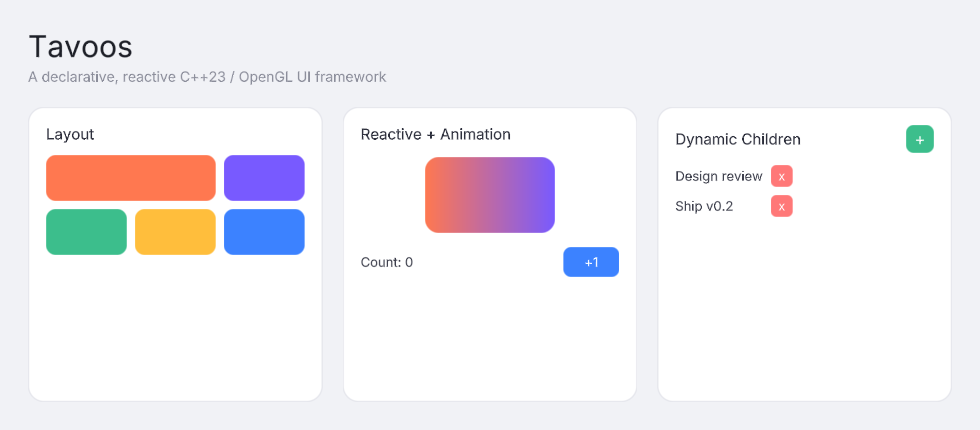

# Tavoos

A C++23/OpenGL 2D UI framework, built around a fluent, declarative widget-builder API.

> **Status: alpha.** Phase 1 is complete. APIs may still change. Developed and tested on Linux.



## Features

- **Fluent, declarative builder API** - widget trees are built with chained setters (C++23 "deducing this"), not verbose imperative construction.
- **Reactive properties** - `Property<T>`/`State<T>` bindings that propagate changes automatically.
- **Layout system** - `Column`, `Row`, `Grid`, and `Flex`.
- **Text, images, and SVG** - font loading with weight/family fallback, JPEG/PNG images, and SVG rendering, all through the same widget model.
- **Resource embedding** - `tavoos_add_resources()` compiles assets (fonts, images) directly into the binary at build time, loaded via `resource:/` paths - no loose files to ship.
- **Animation** - property transitions with easing.

**Controls** (buttons, text fields, etc.) **and graphical effects are planned for phase 2.**

## Example

```cpp
#include <tavoos/application.h>
#include <tavoos/window.h>
#include <tavoos/builder.h>
#include <tavoos/types.h>
#include <tavoos/widget/widgets.h>

using TB = Tavoos::Builder;

class MainWindow : public Tavoos::Window {
public:
    void build() override {
        TB::Rectangle([](Tavoos::RectangleWidget& r) {
            r.width(200).height(80).radius(12)
                .alignment(Tavoos::Alignment::Center)
                .color(Tavoos::Color::rgba(60, 130, 255));

            TB::Text([](Tavoos::TextWidget& t) {
                t.text("Hello, Tavoos").alignment(Tavoos::Alignment::Center).color(Tavoos::Color::White);
            });
        });
    }
};

int main() {
    Tavoos::Application app;

    app.registerFont("Inter", "resource:/assets/fonts/Inter-Regular.ttf", Tavoos::FontWeight::Regular);

    TB::createWindowOf<MainWindow>([](Tavoos::Window& window) {
        window.width(400).height(300).title("Tavoos").color(Tavoos::Color::White);
    });

    return app.run();
}
```

See [examples/main.cpp](examples/main.cpp) for a complete, buildable version.

## Building

See [BUILDING.md](BUILDING.md) for requirements, dependencies, and build/install instructions.

## License

LGPL-3.0 - see [LICENSE](LICENSE).
